# Autonomous Academic Agent (AAA) — Next-Generation Architecture

**Document type:** System Architecture Specification
**Status:** Proposed — implementation-ready
**Supersedes:** AAA v1 (FastAPI + React + LangGraph + Gemini + Tavily + ChromaDB + SQLite)
**Scope:** Complete architectural redesign. No existing capability is removed; every v1 capability is re-hosted inside a new, adaptive-tutor-first design.

---

## Table of Contents

1. [Vision](#1-vision)
2. [Goals](#2-goals)
3. [Complete Architecture](#3-complete-architecture)
4. [Updated Component Diagram](#4-updated-component-diagram)
5. [LangGraph Architecture](#5-langgraph-architecture)
6. [AI Agent Design](#6-ai-agent-design)
7. Knowledge Graph Design
8. Search Pipeline
9. Retrieval Pipeline
10. Embedding Pipeline
11. Learning Pipeline
12. Teaching Pipeline
13. Quiz Pipeline
14. Adaptive Learning Pipeline
15. Database Design
16. REST API Design
17. Authentication
18. Session Management
19. Analytics
20. Folder Structure
21. Testing Strategy
22. Deployment
23. Migration from Current Architecture
24. Future Scope

---

## 1. Vision

AAA v1 proved the core hypothesis: a LangGraph-orchestrated agent stack can parse a syllabus, search the web, and teach a topic end-to-end. What it does not yet do is **behave like a tutor**. It behaves like a well-organized chatbot that happens to teach — it generates a lesson, generates a quiz, and moves on, regardless of whether the student was actually ready for the topic or actually retained it.

The next generation of AAA is built around a single design constraint, taken directly from how expert human tutors operate:

> **The right amount of information, at the right time, in the right format.**

A human tutor never lectures a student on NumPy broadcasting before confirming the student is fluent in Python functions, lists, and loops. A human tutor notices when a student's eyes glaze over during a wall of text and switches to a diagram. A human tutor knows that a wrong answer on a quiz is not "the student is bad at this topic" — it's a signal pointing at *which specific prerequisite* is missing, and reorganizes the lesson plan on the spot.

Every subsystem in this document exists to make one of those three behaviors possible in software:

| Tutor behavior | System capability that implements it |
|---|---|
| Knows what the student already knows | Knowledge Graph + Concept Mastery tracking |
| Knows what the student forgot | Retention/mastery decay model + spaced warm-ups |
| Knows how the student likes learning | Memory Engine + Learning Mode selection |
| Knows which prerequisite is weak | Embedding-aware quiz + Root Cause Analysis |
| Teaches in the right format | Micro-Learning cards + progressive disclosure |
| Reacts instead of restarting | Adaptive Learning Path + LangGraph checkpoint recovery |

AAA v2 is not "AAA v1 plus a knowledge graph." It is a re-architecture where the knowledge graph, the embedding-aware quiz engine, and the adaptive router are the spine of the system, and lesson generation is one of several services that hang off that spine.

This directly supports **SDG 4 (Quality Education)** — personalized mastery-based learning at zero marginal teaching cost — and **SDG 10 (Reduced Inequalities)** by giving every student the equivalent of a 1:1 tutor regardless of access to human tutoring, which remains the grounding thesis carried over from the AAA v1 project charter (Bloom's 2 Sigma Problem).

---

## 2. Goals

### 2.1 Functional Goals

| # | Goal | v1 Status | v2 Requirement |
|---|---|---|---|
| F1 | Parse syllabus into structured topics | ✅ Exists (PDF via `pypdf`) | Preserved, feeds Knowledge Graph ingestion instead of a flat topic list |
| F2 | Search the web for learning resources | ✅ Exists (Tavily) | Preserved, extended with YouTube ranking, caching, fallback |
| F3 | Generate lessons | ✅ Exists (single large-paragraph lesson) | Replaced with micro-learning cards, 3 selectable modes |
| F4 | Generate quizzes | ✅ Exists (lesson-content-only MCQs) | Replaced with embedding-aware, mastery-weighted MCQ engine |
| F5 | Track topic completion | ✅ Exists (basic) | Replaced with per-concept mastery scores, not per-topic booleans |
| F6 | Identify weak areas | ❌ Not present | New: Root Cause Analysis traces failure to specific prerequisite nodes |
| F7 | Adapt the learning path | ❌ Not present | New: Adaptive routing pauses/reroutes instead of repeating the same lesson |
| F8 | Authenticate users | ❌ Not present (single-user/local) | New: full JWT auth, RBAC, refresh tokens |
| F9 | Resume sessions | ⚠️ Partial (in-memory only) | New: durable session state, resumes exactly where the student left off |
| F10 | Learning analytics dashboard | ❌ Not present | New: full analytics + dashboard API |

### 2.2 Non-Functional Goals (Performance Targets)

These directly replace the current "1–2 minutes before first lesson" behavior, which is the single largest usability failure of v1.

| Operation | v1 (measured) | v2 Target | Primary lever |
|---|---|---|---|
| Curriculum generation (syllabus → topic tree) | 45–90s | **< 3s** | Cache + async parse + defer enrichment |
| First lesson generation | 60–120s | **< 8s** | Streaming + prefetch + smaller model for card drafting |
| Quiz generation | 20–40s | **< 3s** | Pre-generated question bank + embedding retrieval, not per-request LLM calls |
| Topic-to-topic transition | 30–60s | **near-instant (< 500ms)** | Smart Prefetching (Section 12) |
| Search + resource ranking | 15–25s | **< 4s** | Redis-cached Tavily results, async fan-out |

### 2.3 Non-Functional Goals (System Qualities)

- **Provider independence** — no single LLM vendor outage should take down teaching or quiz generation.
- **Statefulness with recovery** — a killed pod, a lost connection, or a browser refresh must never lose a student's place.
- **Observability by default** — every agent call, every cache hit/miss, every routing decision is logged in structured form (carried over and extended from v1's structured logging work).
- **Horizontal scalability** — stateless API layer, all state in Postgres/Redis/ChromaDB, so the API and worker layers scale independently.
- **Security by default** — no lesson-injection, no prompt-injection from search results reaching the LLM unsanitized (v1 already introduced sanitization on the Search Agent; this is preserved and generalized to all retrieved-content ingestion points).

---

## 3. Complete Architecture

AAA v2 moves from a "monolithic FastAPI + LangGraph script" model to a **layered service architecture** with a clear separation between orchestration (LangGraph), stateless request handling (FastAPI), long-running work (background workers), and state (Postgres / Redis / ChromaDB). The LangGraph runtime remains the brain of the system — this is not a rewrite away from LangGraph, it is a rewrite of *what the graph is allowed to assume*: every node becomes short, checkpointable, and resumable, instead of one long synchronous chain.

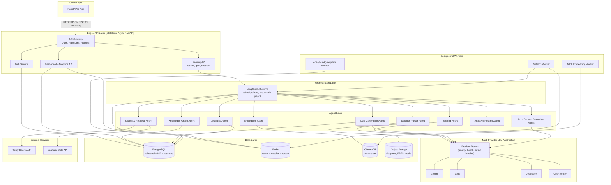

### 3.1 Layering rationale

- **Edge layer is stateless.** Every FastAPI instance is interchangeable; nothing but request-scoped data lives there. This is what makes horizontal scaling and rolling deploys safe.
- **LangGraph is the only place decisions are made.** Routing logic (which agent runs next, whether to pause and reteach a prerequisite) lives entirely inside the graph's conditional edges, not scattered across API handlers. This was a source of hidden coupling in v1 and is explicitly centralized here.
- **Agents are tools, not services with their own state.** Each agent is a pure function over `(state_in) -> state_out` plus explicit calls to the LLM router, ChromaDB, or Postgres. This makes agents independently unit-testable (see Section 21).
- **Background workers own anything that shouldn't block a request.** Prefetching the next chapter, batch-embedding new resources, and rolling up analytics all happen off the request path.
- **The LLM Provider Router is a hard boundary.** No agent ever imports a provider SDK directly. This is what makes multi-provider fallback (Section 6.4 in v1's language, formalized in Section 22 here) possible without touching agent code.

---

## 4. Updated Component Diagram

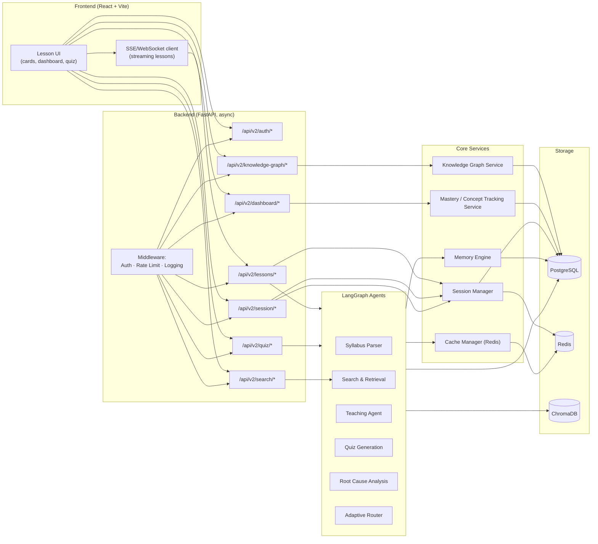

**What changed vs. v1, component by component:**

| v1 Component | v2 Component | Change |
|---|---|---|
| FastAPI monolith (10 endpoints) | FastAPI split into routed sub-apps by domain | Enables independent versioning and rate-limit policy per domain |
| Single LangGraph script | LangGraph with 13 nodes + conditional routing + Postgres/Redis checkpointer | Adds resumability and adaptive branching |
| SQLite | PostgreSQL | Concurrent writes, JSONB for flexible KG metadata, proper migrations |
| ChromaDB (topic + syllabus embeddings) | ChromaDB (topics, resources, quiz question bank, student answer embeddings) | Same engine, expanded collections, retained singleton pattern |
| Search Agent (Tavily only) | Search & Retrieval Agent (Tavily + YouTube Data API + ranking + cache) | No new agent — extended in place, per design mandate |
| Tutor + Quiz Agent (single agent) | Teaching Agent + Quiz Generation Agent + Root Cause Agent (split) | Separation of concerns: teaching, assessment, and diagnosis are different jobs with different latency/quality tradeoffs |
| No auth | Auth Service + JWT + RBAC | New |
| No session persistence | Session Manager (Redis hot state + Postgres durable log) | New |
| No analytics | Analytics Agent + aggregation worker + dashboard API | New |
| Gemini-only | Multi-Provider LLM Router | New abstraction, Gemini remains default provider |

---

## 5. LangGraph Architecture

### 5.1 Design principle: short nodes, explicit state, checkpoint everywhere

v1's graph ran as one long synchronous chain per request, which is precisely why a slow step (e.g., a cold ChromaDB query or a large Gemini generation) blocked everything behind it and why failures meant starting over. v2's graph is built so that **every node is checkpointed**, using LangGraph's built-in persistence (backed by Postgres for durability, mirrored into Redis for low-latency reads of "hot" in-progress sessions). Any node can fail, retry, or be resumed from the last completed node without re-running prior work.

### 5.2 Graph state schema

The graph operates over a single typed state object threaded through every node:

```text
AAAState:
  user_id: str
  session_id: str
  syllabus_id: str | None
  current_topic_id: str | None
  learning_mode: "sprint" | "journey" | "mastery"
  knowledge_graph_snapshot: dict          # relevant subgraph for current topic
  retrieved_resources: list[Resource]
  retrieved_context: list[EmbeddingMatch]
  lesson_cards: list[LessonCard]
  quiz: QuizPayload | None
  quiz_result: QuizResult | None
  root_cause: RootCauseReport | None
  route_decision: "advance" | "reteach_prerequisite" | "retry_quiz" | "complete"
  prefetch_cache_key: str | None
  errors: list[str]
```

### 5.3 Graph topology

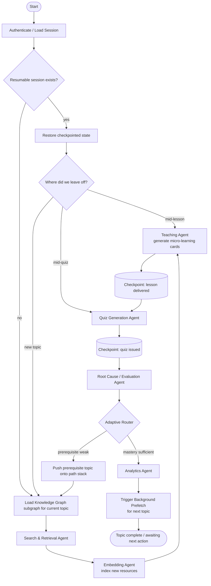

### 5.4 Why this topology

- **`AUTHN → RESUME` gate first.** No agent work happens until we know whether this is a fresh topic start or a resumed session — this single gate is what eliminates "lost progress," addressing v1's biggest reliability gap.
- **`INITKG` before `SEARCH`.** The Knowledge Graph subgraph for the current topic (its prerequisites, its children, current mastery scores for each) is loaded first because every downstream agent needs it: Search uses it to decide whether to also fetch prerequisite resources, Quiz uses it to decide the mastery-weighted question ratio (Section 13), and the Adaptive Router uses it to decide where to reroute.
- **Two checkpoints inside a single topic pass** (`lesson delivered`, `quiz issued`) rather than one at the end. This is what makes "student closed the tab mid-quiz" recoverable without re-teaching the lesson.
- **`ADAPT` is a real branch, not a flag.** When mastery is insufficient, the graph does not loop back into `TEACH` for the *same* topic (that was v1's failure mode — re-explaining the same content in different words). It pushes the diagnosed weak prerequisite onto a **path stack** and re-enters `INITKG` for that prerequisite instead. The original topic is *paused*, not abandoned — its position on the stack is preserved, and `INITKG` pops back to it once the prerequisite chain clears the mastery threshold. This directly implements the NumPy → Lists → Functions → Loops → resume-NumPy example from the design brief (elaborated in Section 14).
- **`PREFETCH` fires after `ANALYTICS`, not blocking the user.** It's dispatched to the background worker queue and the graph run for *this* topic ends immediately after — the user is never waiting on prefetch.

---

## 6. AI Agent Design

Nine agents replace v1's three. This is a **decomposition**, not new scope creep beyond the brief's explicit mandate — the brief asks for a Search Agent redesign (not a new agent), a Tutor+Quiz redesign into teaching/quiz/diagnosis, and new Knowledge-Graph-aware and Adaptive-Routing capabilities.

| Agent | Responsibility | Reads | Writes | LLM used | p95 latency target |
|---|---|---|---|---|---|
| **Syllabus Parser** | Extract topics + raw ordering from uploaded PDF/text | Uploaded file | `KnowledgeGraphTopics` (draft) | `gemini-2.5-flash-lite` (cost-efficient extraction) | 4s |
| **Knowledge Graph Agent** | Resolve draft topics into a validated prerequisite graph; insert/update nodes and edges | `KnowledgeGraphTopics`, existing graph | Graph nodes + edges (Section 7) | `gemini-2.5-flash-lite` (dependency inference) + deterministic graph algorithms | 3s (async, off critical path after first pass) |
| **Search & Retrieval Agent** | Query Tavily + YouTube, rank, categorize, cache | Topic + KG context | `Resources`, `YouTubeResources`, Redis cache | none (deterministic ranking) — LLM only for summarization | 4s |
| **Embedding Agent** | Embed new resources, lesson cards, quiz questions | Raw text | ChromaDB collections | `gemini-embedding-001` (768-dim, consistent with v1) | 1–2s (batched) |
| **Teaching Agent** | Generate micro-learning cards for the current topic, at the selected learning mode | KG context, retrieved resources, student memory profile | `lesson_cards` (state), `Resources` cache | `gemini-2.5-flash` (quality-sensitive) | 8s (streamed, first card < 2s) |
| **Quiz Generation Agent** | Build embedding-aware, mastery-weighted MCQ set | KG context, `ConceptMastery`, quiz question bank (ChromaDB + Postgres) | `QuizQuestions`, `QuizAttempts` | Question bank first (no LLM call); `gemini-2.5-flash-lite` only on bank miss | 3s (bank hit ~instant) |
| **Root Cause / Evaluation Agent** | Score quiz, trace wrong answers back to concept tags, build weak-concept report | `QuizAttempts`, KG edges | `ConceptMastery` updates, `RootCauseReport` | Deterministic scoring + `gemini-2.5-flash-lite` for narrative explanation only | 2s |
| **Adaptive Routing Agent** | Decide advance / reteach-prerequisite / retry-quiz / complete | `RootCauseReport`, `ConceptMastery`, path stack | `route_decision`, path stack | none (deterministic policy, Section 14) | < 200ms |
| **Analytics Agent** | Emit structured learning events for aggregation | Every prior node's output | `AnalyticsEvents` (append-only) | none | async, non-blocking |

### 6.1 Why split Teaching, Quiz, and Root Cause into three agents instead of one "Tutor + Quiz Agent"

v1's single Tutor+Quiz agent conflated three jobs with fundamentally different requirements:

- **Teaching** is generative and latency-tolerant if streamed (the student is reading, so 8 seconds is fine if the first card appears in 2).
- **Quiz generation** should almost never call an LLM at request time — it should draw from a pre-generated, embedding-indexed question bank (Section 13), making it a retrieval problem, not a generation problem, 95% of the time.
- **Root cause analysis** is mostly deterministic (map wrong answers → concept tags → KG lookup) with the LLM used only to phrase the explanation, so it should never be blocked by, or block, generation-heavy teaching calls.

Splitting them means each can be scaled, cached, and rate-limited independently, and a slow LLM provider affects teaching latency without also stalling quiz scoring.

### 6.2 Why the Search Agent is extended, not replaced

Per the design mandate, no new "YouTube Agent" is introduced. The existing Search Agent's Tavily integration, retry logic, and prompt-injection sanitization (already hardened in v1) are preserved as the substrate; YouTube retrieval is added as a second retrieval branch inside the same agent, sharing the same ranking, caching, and fallback infrastructure (detailed in Section 8).
## 7. Knowledge Graph Design

### 7.1 Why not a dedicated graph database

Neo4j or similar would be the "obvious" choice, but it adds a fourth stateful system (alongside Postgres, Redis, ChromaDB) for a workload that is overwhelmingly **shallow traversal** (ancestors/descendants of a node, 2–4 hops deep) rather than complex graph analytics. PostgreSQL, with an **adjacency-list table plus a materialized closure table**, gives near-graph-database traversal performance at these depths while keeping the operational footprint at three stateful systems instead of four, and keeping topic metadata joinable with everything else (mastery, resources, quiz questions) in a single query engine.

### 7.2 Node schema

```text
Topic
  id                UUID (PK)
  name              text
  slug              text (unique)
  description        text
  difficulty         enum(beginner, intermediate, advanced)
  learning_depth      int        -- estimated minutes to reach working competency
  bloom_target_level   enum(remember, understand, apply, analyze, evaluate, create)
  syllabus_id         UUID (FK, nullable -- topics can exist outside any single syllabus)
  embedding_id         text (FK -> ChromaDB vector id)
  mastery_threshold     float default 0.75   -- score required to consider this topic "mastered"
  created_at, updated_at
```

### 7.3 Edge schema (prerequisite relationships)

```text
TopicEdge
  id                UUID (PK)
  parent_topic_id      UUID (FK -> Topic.id)   -- the topic that depends on child
  child_topic_id       UUID (FK -> Topic.id)   -- the prerequisite
  relationship_type     enum(direct_prerequisite, related_concept, part_of)
  weight             float   -- strength of dependency, used in quiz ratio calc (Section 13)
  created_by          enum(llm_inferred, human_curated)
  created_at
```

`parent_topic_id` depends on `child_topic_id` — e.g., `NumPy --(direct_prerequisite, weight 0.9)--> Loops`.

### 7.4 Closure table (materialized transitive closure)

Direct edges alone make "give me *every* prerequisite of NumPy, direct and indirect" an expensive recursive query at request time. A closure table precomputes it:

```text
TopicClosure
  ancestor_id     UUID   -- the topic that (in)directly requires descendant
  descendant_id    UUID   -- the (in)direct prerequisite
  depth         int    -- 1 = direct prerequisite, 2+ = indirect
  PRIMARY KEY (ancestor_id, descendant_id)
```

This table is maintained by the Knowledge Graph Agent on every edge insert/update (Section 7.6) via incremental recomputation, not a full rebuild — inserting one edge only requires joining the new edge against existing closure rows for its two endpoints, which is O(affected rows), not O(graph).

### 7.5 Example graph (from design brief)

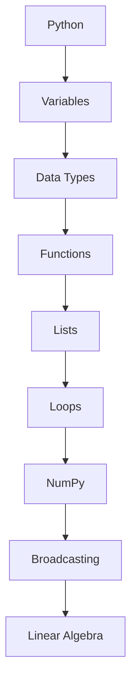

Represented as edges: `Broadcasting depends_on NumPy`, `NumPy depends_on Loops`, `Loops depends_on Lists`, etc. The closure table additionally stores `LinearAlgebra → Python` at `depth=8`, so "does this student have every prerequisite for Linear Algebra" is a single indexed lookup, not a graph walk at request time.

### 7.6 Insertion / update workflow

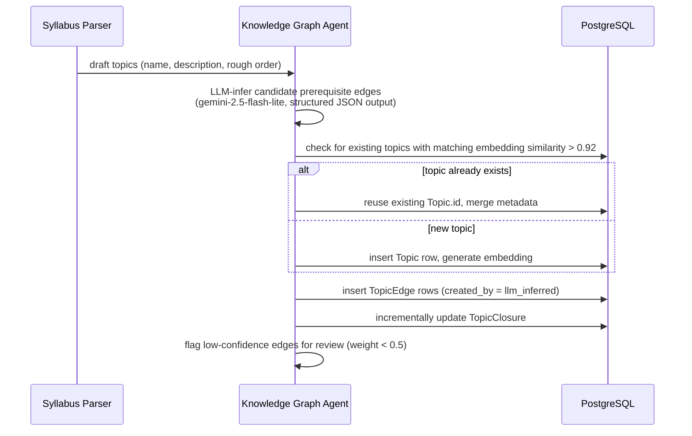

De-duplication uses embedding similarity (via the Embedding Pipeline, Section 10) against existing topic names/descriptions before inserting a new node, so re-parsing an overlapping syllabus does not fragment the graph into near-duplicate topics (e.g., "Python Lists" vs. "Lists in Python").

### 7.7 Traversal operations used elsewhere in the system

| Operation | Query pattern | Consumer |
|---|---|---|
| Get all direct prerequisites | `TopicEdge WHERE parent_topic_id = ?` | Teaching Agent (what to briefly recap) |
| Get all transitive prerequisites | `TopicClosure WHERE ancestor_id = ?` | Quiz Generation Agent (candidate pool for prerequisite questions) |
| Get topological learning order | Kahn's algorithm over `TopicEdge` subgraph for a syllabus | Curriculum generation (Section 11) |
| Find weakest ancestor | Join `TopicClosure` + `ConceptMastery`, order by mastery ascending | Root Cause / Adaptive Router (Section 14) |
| Get children (topics that build on this one) | `TopicEdge WHERE child_topic_id = ?` | Dashboard "what's next" |

### 7.8 Integration with LangGraph

The Knowledge Graph is exposed to the graph runtime as a **tool**, not as a node that mutates it directly during a learning session — `INITKG` (Section 5.3) calls a read-only `get_topic_context(topic_id)` tool that returns direct prerequisites, transitive prerequisite mastery scores, and children in one call, populating `knowledge_graph_snapshot` in state. Writes to the graph (new topics, new edges) happen only via the Knowledge Graph Agent during syllabus ingestion or explicit curation, never mid-lesson — this keeps the graph read path fast and side-effect-free during active tutoring.

---

## 8. Search Pipeline

### 8.1 Scope

The existing Search Agent (Tavily-based, with retry logic and prompt-injection sanitization already hardened in v1) is extended in place with a second retrieval branch for YouTube, shared ranking, shared caching, and a shared fallback chain. No new agent is introduced.

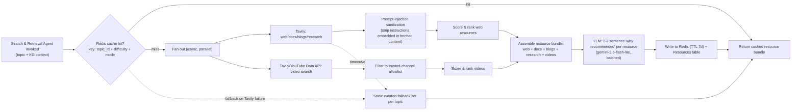

### 8.2 Trusted-channel allowlist

YouTube results are filtered to a curated allowlist before ranking, rather than ranked from an open search, to avoid low-quality or clickbait content entering a tutoring context:

freeCodeCamp, Corey Schafer, Programming with Mosh, Tech With Tim, CS50, MIT OpenCourseWare, Stanford Online, Harvard, 3Blue1Brown, Google Developers, StatQuest, Fireship, Traversy Media.

The allowlist is stored as a Postgres table (`TrustedChannels`), not hardcoded, so it can be extended without a deploy.

### 8.3 Ranking algorithm

Each resource receives a composite score:

```text
score = (0.40 * relevance)        -- semantic similarity between resource text/transcript and topic embedding
      + (0.25 * source_authority)  -- allowlist tier for video; domain-authority tier for web (official docs > blog > forum)
      + (0.20 * difficulty_match)  -- how well resource difficulty matches student's current level
      + (0.15 * freshness)         -- recency decay, lighter weight since fundamentals don't go stale
```

`relevance` reuses the Embedding Pipeline (Section 10) — the resource is embedded once at ingestion and compared against the topic's embedding, so ranking is a vector similarity lookup, not a per-request LLM judgment call.

### 8.4 Caching and fallback

- **Cache key:** `search:{topic_id}:{difficulty}:{learning_mode}`, TTL 7 days (content for "Python Loops" doesn't change week to week; TTL is short enough to pick up new high-quality uploads).
- **Fallback chain:** Redis cache → live Tavily/YouTube fan-out → static curated fallback table (a small, manually reviewed set of resources per common topic, seeded at launch) → graceful degradation to "resources temporarily unavailable, lesson continues without external links" rather than blocking the lesson.
- **Prompt-injection sanitization** (already present in v1) is applied to every fetched web page and video transcript **before** any of that text reaches an LLM prompt — this is preserved unchanged as a hard boundary, and extended to cover YouTube transcripts, which v1 never ingested.

---

## 9. Retrieval Pipeline

Retrieval is the RAG layer that assembles the actual context window for the Teaching and Quiz agents — distinct from Search (which discovers *external* resources to recommend) in that Retrieval pulls from AAA's **own** indexed knowledge (previously generated lesson cards, resource summaries, prior quiz explanations).

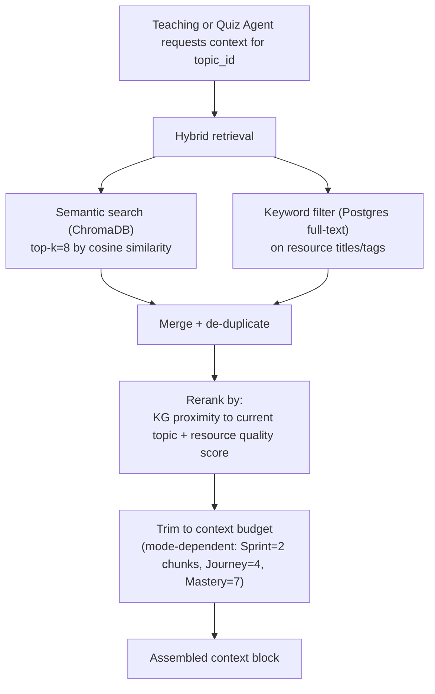

- **Why hybrid, not pure semantic:** pure vector search occasionally surfaces topically-similar-but-wrong-level content (e.g., an advanced NumPy article for a student on introductory loops); the keyword/tag filter constrains candidates to the correct difficulty band before reranking.
- **KG-proximity reranking** boosts context chunks that come from the *current* topic or its direct prerequisites over tangentially related ones — this is where the Knowledge Graph and Retrieval pipelines interlock.
- **Context budget scales with Learning Mode** (Section 12) — Sprint Mode lessons deliberately retrieve less context so the generated cards stay short, rather than truncating a large generation after the fact.

---

## 10. Embedding Pipeline

### 10.1 Model choice

`gemini-embedding-001` at **768 dimensions**, matching the model and dimensionality already in production use in AAA v1's ChromaDB integration. Keeping the same embedding model is a deliberate compatibility decision: it means v1's existing ChromaDB collections do not need to be re-embedded during migration (Section 23), and new v2 collections stay comparable against them.

### 10.2 What gets embedded

| Content type | Collection | Trigger |
|---|---|---|
| Topic name + description | `topics` | Topic insert/update (Knowledge Graph Agent) |
| Resource text/transcript summary | `resources` | New resource ingested (Search Agent) |
| Lesson card content | `lesson_cards` | Card generated (Teaching Agent) |
| Quiz question + explanation | `quiz_questions` | Question generated (Quiz Agent) — enables similarity-based dedup |
| Student free-text answers (future short-answer support) | `student_responses` | Quiz submission |

### 10.3 Batch embedding worker

Embeddings are **never generated one at a time on the request path** except for the single query embedding needed for a retrieval call. Bulk content (a freshly parsed syllabus producing 40 topics, or a search returning 12 new resources) is embedded via the Batch Embedding Worker, which:

1. Collects pending embedding jobs from a Redis queue.
2. Batches up to 100 texts per Gemini embedding call (respecting provider batch limits).
3. Writes vectors to ChromaDB and marks the source row (`Topic`, `Resource`, etc.) with `embedding_id` + `embedded_at`.
4. Retries with exponential backoff through the Provider Router on transient failures.

### 10.4 Recompute policy

Embeddings are recomputed only when source text changes materially (content hash mismatch), not on every read — an `embedding_stale` flag is set on edit and cleared by the next worker pass, keeping steady-state embedding volume low.

---

## 11. Learning Pipeline

The end-to-end path a student takes through one topic, tying together every pipeline above:

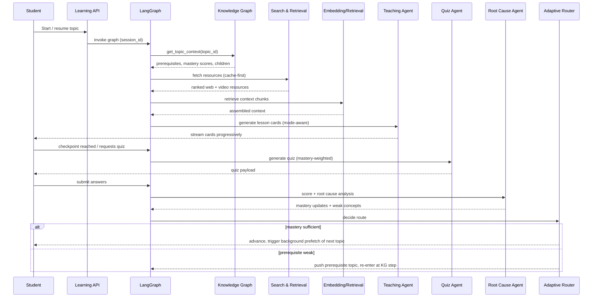

This diagram is the single reference sequence every pipeline section below elaborates on for its own slice.

---

## 12. Teaching Pipeline

### 12.1 Micro-learning cards, not paragraphs

Every lesson is decomposed into cards, each constrained to:

- **One concept**
- **One explanation** (2–4 sentences)
- **One example** (code, diagram, or real-world analogy)
- **One takeaway** (a single reinforcing sentence)

A full topic at Journey Mode is typically 4–7 cards, each independently streamable — the UI renders card 1 the moment it's generated rather than waiting for the full set, which is the primary lever behind the "first lesson < 8s, first visible content < 2s" target from Section 2.

### 12.2 Learning Modes

| Mode | Target length | Content depth | Best for |
|---|---|---|---|
| **Sprint** | 2–3 minutes | Definition + one example, minimal theory | Review, time-constrained study |
| **Journey** | 5–8 minutes | Explanation + example + analogy + mini-checkpoint | Default, first-time learning |
| **Mastery** | 12–20 minutes | Theory + implementation details + edge cases + advanced example | Deep understanding, exam prep |

Mode is selected **per chapter**, with a preview shown before commitment (a rendered example card in each mode's style, generated once per topic and cached, not regenerated per preview request). After each chapter, the student is prompted to continue in the same mode or switch for the next one — this preference (along with the switch pattern itself) is written to the Memory Engine so default mode selection adapts over time.

### 12.3 In-lesson micro-requests

During a lesson, the student can request, without changing their selected mode:

- Explain in more detail
- Make it shorter
- Show another analogy
- Show more code
- Recommend a video

Each of these is handled as a **targeted regeneration of the current card only** (a lightweight LLM call scoped to that one card's content, not a full lesson re-generation), and is logged to the Memory Engine as a signal — repeated "show more code" requests on a given topic type bias future default card composition toward more code examples for that student.

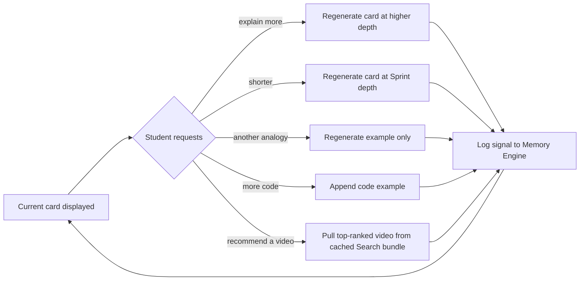

### 12.4 Memory Engine

A per-student profile of *how* they learn, distinct from *what* they've learned (which lives in Concept Mastery):

```text
MemoryProfile
  user_id
  prefers_analogies        float (0-1, updated via exponential moving average on signals)
  prefers_code_examples      float
  prefers_shorter_lessons     float
  default_learning_mode      enum
  known_struggle_patterns     jsonb   -- e.g. {"recursion": "struggles", "iteration": "strong"}
  updated_at
```

Every card-regeneration request, every mode switch, and every quiz outcome emits a signal that nudges these floats via EMA (`new = old*0.85 + signal*0.15`), so recent behavior dominates without one bad day overriding weeks of pattern. The Teaching Agent reads this profile when composing cards and biases toward the student's demonstrated preferences by default, without the student needing to configure anything.

---

## 13. Quiz Pipeline

### 13.1 Why quiz generation must not be "lesson content only"

v1 generated MCQs purely from the just-taught lesson text, which means a quiz on NumPy could never actually test whether the student's NumPy struggles are really a Lists or Loops problem — the two most common root causes are invisible to a lesson-scoped quiz by construction. v2 draws questions from a pool spanning the current topic **and** its prerequisites, weighted by measured mastery.

### 13.2 Mastery-weighted question distribution

```text
mastery_score(topic) = weighted average of ConceptMastery.score
                        across topic + its direct prerequisites

if mastery_score >= 0.75:  ratio = 80% current / 20% prerequisite
if 0.50 <= mastery_score < 0.75: ratio = 60% current / 40% prerequisite
if mastery_score < 0.50:      ratio = 30% current / 70% prerequisite
```

Prerequisite questions are drawn preferentially from the **weakest** prerequisite (lowest `ConceptMastery.score` among direct ancestors in the closure table), so the 70% "prerequisite" slice in a low-mastery case concentrates on the single most likely root cause rather than spreading thin across every ancestor.

### 13.3 MCQ schema

```text
QuizQuestion
  id                 UUID
  topic_id             UUID (FK)
  concept_tag           text          -- specific sub-concept, e.g. "list slicing" not just "Lists"
  question             text
  options              jsonb (4 options)
  correct_answer          text
  explanation            text
  difficulty             enum(easy, medium, hard)
  bloom_level            enum(remember, understand, apply, analyze, evaluate, create)
  estimated_time_seconds     int
  confidence_score         float    -- model's confidence in question quality/correctness at generation time
  question_tag           text[]    -- free-form tags for analytics/search
  embedding_id            text (FK -> ChromaDB)
  created_at
```

### 13.4 Generation vs. retrieval

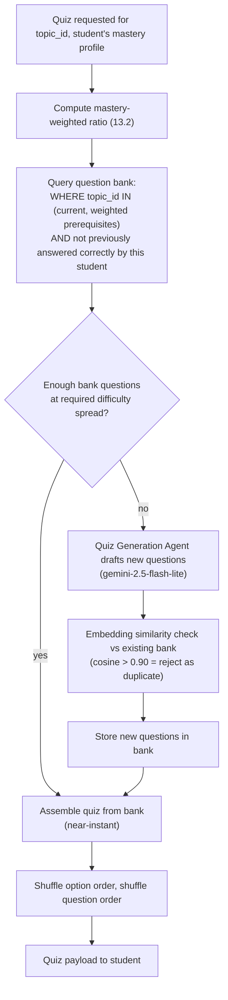

Because the bank grows every time generation *is* needed, the system's steady-state behavior converges toward the fast "bank hit" path — the < 3s quiz-generation target (Section 2.2) is a statement about steady state, not the first time a brand-new topic is quizzed.

### 13.5 Retakes and duplicate avoidance

- Retakes exclude questions the student has already answered *correctly* for that topic, but may reuse questions previously answered *incorrectly* (to explicitly re-test the exact failure point) alongside fresh ones.
- Cross-question duplicate avoidance uses the same embedding-similarity check as generation-time dedup, applied at assembly time so two near-identical bank questions are never served together in one quiz.

---

## 14. Adaptive Learning Pipeline

### 14.1 Root Cause Analysis

Scoring a quiz produces more than a percentage — every wrong answer is tagged with its `concept_tag`, and those tags are aggregated against the Knowledge Graph to identify which **prerequisite**, not just which question, is the likely failure point.

```text
for each incorrect answer:
    concept = question.concept_tag
    topic = resolve_topic(concept)
    ConceptMastery[topic].score -= f(question.difficulty, question.bloom_level)

weak_concepts = ConceptMastery entries below topic.mastery_threshold,
                restricted to {current_topic} ∪ TopicClosure.descendants(current_topic)

root_cause = weakest ancestor in weak_concepts, by (score ascending, closure depth ascending)
             -- ties broken toward the *closer* prerequisite, since fixing the nearest
                gap is more likely to unblock the current topic than a distant one
```

Output artifacts:

- **Weak Concept Report** — per-concept mastery deltas from this attempt.
- **Knowledge Gap Report** — the full set of below-threshold ancestors.
- **Root Cause Analysis** — the single highest-priority prerequisite to address next.
- **Dependency Trace** — the path from `root_cause` to `current_topic` through the graph, shown to the student as "here's why we're pausing NumPy to revisit Lists."
- **Confidence Score** / **Mastery Score** — carried on `ConceptMastery` per topic.

### 14.2 Adaptive routing policy

```mermaid
flowchart TD
    RESULT["Quiz scored + root cause computed"] --> CHECK{current_topic mastery >= threshold?}
    CHECK -- yes --> ADVANCE["Advance: mark topic mastered,<br/>pop path stack if this was a reroute target"]
    CHECK -- no --> HASROOT{Root cause = current topic itself<br/>(no weak ancestor found)?}
    HASROOT -- yes --> RETRY["Offer retry: alternate question set,<br/>same topic, no reteach yet"]
    HASROOT -- no --> PAUSE["Pause current topic (push onto path stack)"]
    PAUSE --> REROUTE["Set current_topic = root_cause topic"]
    REROUTE --> REENTER["Re-enter graph at INITKG for root_cause topic"]
    ADVANCE --> STACK{Path stack non-empty?}
    STACK -- yes --> POP["Pop stack, resume paused topic"]
    STACK -- no --> COMPLETE["Topic flow complete"]
```

This is a **deterministic policy** (no LLM call on the routing decision itself, per Section 6's latency table — routing must be sub-200ms), which also makes it fully unit-testable: given a `(mastery_scores, path_stack)` tuple, the next state is a pure function.

### 14.3 Path stack and checkpoint recovery

The path stack (`[NumPy, Loops, Lists]` in the design brief's example, most-recently-paused on top) is part of `AAAState` and is checkpointed by LangGraph at every graph step (Section 5.1). If the process crashes or the student closes the browser mid-reroute, session resume (`RESUME` gate, Section 5.3) restores the exact stack and topic position — the student reopens the app already inside "Teach Lists," with NumPy still correctly parked underneath.

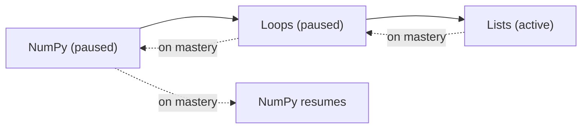

### 14.4 Why prerequisite failure pauses instead of reteaching in place

Reteaching NumPy "in different words" when the real gap is Lists produces the exact failure mode the design brief calls out: the student re-reads content about a topic they already technically understood the surface of, while the actual blocker goes unaddressed. Pausing and rerouting to the diagnosed root cause means every re-teach is spent on the concept that's actually missing, and the original topic resumes with that gap closed rather than papered over.
## 15. Database Design

### 15.1 Engine choice

**PostgreSQL** replaces SQLite as the system of record. SQLite's single-writer model is incompatible with a multi-user, concurrent-session, background-worker architecture; Postgres additionally provides JSONB (for flexible KG/quiz metadata without a migration per new field), recursive CTEs (backing the closure-table maintenance in Section 7.4), and proper row-level locking for concurrent mastery updates. ChromaDB is retained unchanged as the vector store, and Redis is added for cache/session/queue.

### 15.2 Entity-relationship overview

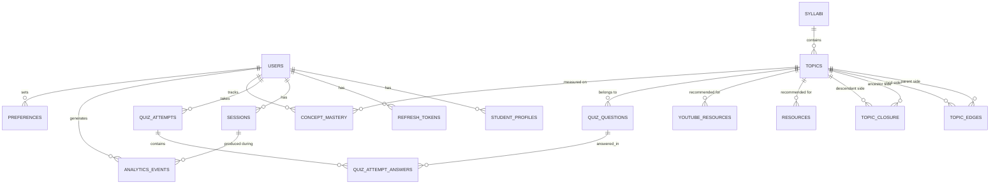

### 15.3 Table definitions

**Users**

| Field | Type | Notes |
|---|---|---|
| id | UUID PK | |
| email | text, unique | |
| password_hash | text | bcrypt/argon2 |
| role | enum(student, admin, instructor) | instructor reserved for Future Scope |
| email_verified | bool | |
| created_at, updated_at | timestamptz | |

**StudentProfiles** (1:1 with Users; the Memory Engine's durable store)

| Field | Type | Notes |
|---|---|---|
| user_id | UUID PK/FK | |
| learning_goals | text[] | |
| preferred_language | text | |
| default_learning_mode | enum(sprint, journey, mastery) | |
| prefers_analogies, prefers_code_examples, prefers_shorter_lessons | float | EMA-updated, Section 12.4 |
| known_struggle_patterns | jsonb | |
| study_streak_days | int | |
| total_study_time_seconds | int | |
| updated_at | timestamptz | |

**Syllabi**

| Field | Type | Notes |
|---|---|---|
| id | UUID PK | |
| user_id | UUID FK | owner |
| title | text | |
| source_file_url | text | object storage pointer |
| status | enum(parsing, ready, failed) | |
| created_at | timestamptz | |

**Topics** — as defined in Section 7.2.
**TopicEdge** — as defined in Section 7.3.
**TopicClosure** — as defined in Section 7.4.

**Resources**

| Field | Type | Notes |
|---|---|---|
| id | UUID PK | |
| topic_id | UUID FK | |
| type | enum(web, docs, blog, research) | |
| url | text | |
| title | text | |
| summary | text | LLM-generated, 1–2 sentences |
| why_recommended | text | |
| relevance_score | float | Section 8.3 |
| difficulty | enum | |
| embedding_id | text FK -> ChromaDB | |
| cached_at | timestamptz | |

**YouTubeResources**

| Field | Type | Notes |
|---|---|---|
| id | UUID PK | |
| topic_id | UUID FK | |
| video_id | text | YouTube ID |
| channel_name | text | must be in `TrustedChannels` |
| title | text | |
| duration_seconds | int | |
| relevance_score | float | |
| transcript_summary | text | |
| embedding_id | text FK | |
| cached_at | timestamptz | |

**TrustedChannels**

| Field | Type | Notes |
|---|---|---|
| id | UUID PK | |
| channel_name | text unique | |
| authority_tier | int | used in ranking (Section 8.3) |

**QuizQuestions** — as defined in Section 13.3.

**QuizAttempts**

| Field | Type | Notes |
|---|---|---|
| id | UUID PK | |
| user_id | UUID FK | |
| topic_id | UUID FK | |
| session_id | UUID FK | |
| score | float | |
| ratio_current_vs_prereq | jsonb | e.g. `{"current":0.6,"prereq":0.4}` recorded for audit |
| started_at, submitted_at | timestamptz | |

**QuizAttemptAnswers**

| Field | Type | Notes |
|---|---|---|
| id | UUID PK | |
| attempt_id | UUID FK | |
| question_id | UUID FK | |
| selected_answer | text | |
| is_correct | bool | |
| time_taken_seconds | int | |

**ConceptMastery**

| Field | Type | Notes |
|---|---|---|
| user_id | UUID FK | composite PK with topic_id |
| topic_id | UUID FK | |
| score | float (0-1) | decays over time (retention model) |
| confidence | float | model's confidence in the score given attempt volume |
| last_practiced_at | timestamptz | drives decay + spaced warm-ups |
| attempts_count | int | |

**Sessions**

| Field | Type | Notes |
|---|---|---|
| id | UUID PK | |
| user_id | UUID FK | |
| current_topic_id | UUID FK nullable | |
| path_stack | jsonb | Section 14.3 |
| graph_checkpoint_id | text | LangGraph checkpointer pointer |
| status | enum(active, idle, completed) | |
| last_active_at | timestamptz | |
| created_at | timestamptz | |

**RefreshTokens**

| Field | Type | Notes |
|---|---|---|
| id | UUID PK | |
| user_id | UUID FK | |
| token_hash | text | never store raw token |
| expires_at | timestamptz | |
| revoked | bool | |
| created_at | timestamptz | |

**Preferences**

| Field | Type | Notes |
|---|---|---|
| user_id | UUID PK/FK | |
| notification_settings | jsonb | |
| theme | text | |
| timezone | text | |

**AnalyticsEvents** (append-only, partitioned by month)

| Field | Type | Notes |
|---|---|---|
| id | UUID PK | |
| user_id | UUID FK | |
| session_id | UUID FK | |
| event_type | text | e.g. `lesson_card_viewed`, `quiz_submitted`, `mode_switched` |
| payload | jsonb | event-specific data |
| created_at | timestamptz | |

### 15.4 Indexing notes

- `TopicClosure(ancestor_id)` and `TopicClosure(descendant_id)` both indexed — traversal happens from either direction (Section 7.7).
- `ConceptMastery(user_id, topic_id)` composite index — hot path for every mastery-ratio calculation.
- `AnalyticsEvents` partitioned monthly with an index on `(user_id, event_type, created_at)` to keep dashboard queries fast as the table grows.
- `QuizQuestions(topic_id, difficulty, concept_tag)` composite index — the bank-lookup hot path (Section 13.4).

---

## 16. REST API Design

All routes versioned under `/api/v2/`. v1's 10-endpoint OpenAPI surface is preserved in spirit but regrouped by domain; a compatibility note per group is included where a v1 endpoint maps directly.

**Auth**

| Method | Path | Description |
|---|---|---|
| POST | `/auth/register` | Create account, sends verification email |
| POST | `/auth/login` | Returns access + refresh token |
| POST | `/auth/logout` | Revokes refresh token |
| POST | `/auth/refresh` | Exchanges refresh token for new access token |
| POST | `/auth/forgot-password` | Sends reset link |
| POST | `/auth/reset-password` | Consumes reset token |
| GET | `/auth/verify-email/{token}` | Confirms email |

**Knowledge Graph**

| Method | Path | Description |
|---|---|---|
| GET | `/knowledge-graph/{syllabus_id}` | Full topic tree for a syllabus |
| GET | `/knowledge-graph/topic/{topic_id}/context` | Direct + transitive prerequisites, mastery-annotated |
| GET | `/knowledge-graph/topic/{topic_id}/children` | Topics that build on this one |
| POST | `/knowledge-graph/topic/{topic_id}/edge` | (admin) manually curate an edge |

**Lessons** (v1 equivalent: `POST /generate-lesson`)

| Method | Path | Description |
|---|---|---|
| POST | `/lessons/{topic_id}/start` | Begin or resume topic; returns SSE stream of cards |
| POST | `/lessons/{topic_id}/card/{card_id}/refine` | In-lesson micro-request (Section 12.3) |
| POST | `/lessons/{topic_id}/mode` | Select/switch learning mode for next chapter |

**Quiz** (v1 equivalent: `POST /generate-quiz`)

| Method | Path | Description |
|---|---|---|
| GET | `/quiz/{topic_id}` | Assemble mastery-weighted quiz |
| POST | `/quiz/{attempt_id}/submit` | Submit answers, triggers Root Cause + Adaptive Router |
| GET | `/quiz/{attempt_id}/result` | Score + weak concept report + dependency trace |

**Search**

| Method | Path | Description |
|---|---|---|
| GET | `/search/{topic_id}/resources` | Ranked web + video bundle (cache-first) |
| POST | `/search/{topic_id}/refresh` | Force cache bypass (admin/debug) |

**Recommendations**

| Method | Path | Description |
|---|---|---|
| GET | `/recommendations/{user_id}/next-topics` | KG-driven "what to study next" |
| GET | `/recommendations/{user_id}/videos` | Top-ranked videos across weak topics |

**Sessions**

| Method | Path | Description |
|---|---|---|
| GET | `/session/current` | Resume state: topic, path stack, mode |
| POST | `/session/heartbeat` | Keep-alive, updates `last_active_at` |
| POST | `/session/end` | Explicit close, flushes checkpoint |

**Progress / Dashboard**

| Method | Path | Description |
|---|---|---|
| GET | `/dashboard/{user_id}` | Aggregate: KG progress, weak topics, streak, mastery |
| GET | `/dashboard/{user_id}/knowledge-graph-progress` | Per-node mastery overlay |
| GET | `/progress/{user_id}/{topic_id}` | Single-topic mastery detail |

**Analytics**

| Method | Path | Description |
|---|---|---|
| GET | `/analytics/{user_id}/summary` | Study time, accuracy, velocity, retention |
| GET | `/analytics/{user_id}/insights` | Generated natural-language insights |

**Resources**

| Method | Path | Description |
|---|---|---|
| GET | `/resources/{topic_id}` | List cached resources with metadata |

---

## 17. Authentication

### 17.1 Flow

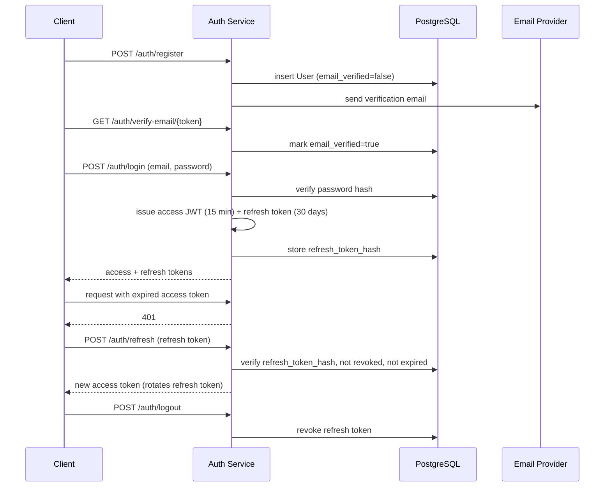

### 17.2 Token design

- **Access token:** JWT, 15-minute expiry, carries `user_id`, `role`, `email_verified`. Stateless verification — no DB hit on every request.
- **Refresh token:** opaque random token, stored **hashed** in `RefreshTokens`, 30-day expiry, rotated on every use (old token revoked, new one issued) to limit replay-attack windows.
- **RBAC:** `role` claim gates route access via a FastAPI dependency; `student` is default, `admin` unlocks curation endpoints (Section 16), `instructor` is reserved for Future Scope (Section 24) but modeled now to avoid a breaking schema change later.

### 17.3 Password reset / forgot password

Single-use, short-expiry (30 min) reset tokens, same hashed-storage pattern as refresh tokens, invalidated immediately on use or on password change.

---

## 18. Session Management

### 18.1 Two-tier state

| Tier | Store | Purpose |
|---|---|---|
| Hot | Redis | Active session's in-flight `AAAState` (Section 5.2), sub-millisecond reads during an active graph run |
| Durable | PostgreSQL `Sessions` table | Authoritative checkpoint pointer + path stack, survives Redis eviction/restart |

Every LangGraph checkpoint write (Section 5.1) writes to both: Redis immediately (for the current request's low-latency continuation) and Postgres synchronously before the graph node returns control (for durability). This is the mechanism behind Goal F9 (Section 2.1) — a Redis flush or pod restart loses only the hot cache, never the actual resume point.

### 18.2 Resume flow

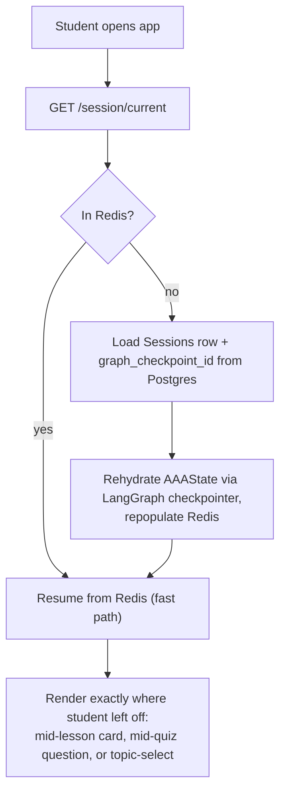

### 18.3 What's persisted

Current lesson and chapter, reading progress (last card index viewed), current quiz state (which questions answered, which pending), selected answers, weak concepts identified so far this session, and the active learning mode — matching the design brief's explicit session-state requirements in full.

---

## 19. Analytics

### 19.1 Event-sourced pipeline

Every meaningful student action emits an `AnalyticsEvents` row (Section 15.3) at write time, not in a batch — this keeps the event log a true append-only source of truth. Aggregation, not ingestion, is what's deferred to background processing.

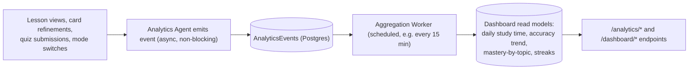

### 19.2 Tracked metrics

Study time, attempt counts, accuracy, confidence (model's confidence in the mastery estimate, from Section 15.3), retention (mastery decay rate observed over time), learning velocity (topics mastered per study hour), improvement (delta in accuracy on retaken concepts), and per-topic mastery.

### 19.3 Insight generation

Insights (`/analytics/{user_id}/insights`) are produced by a scheduled job that runs simple statistical rules first (e.g., "accuracy on X dropped after 3+ days without practice → flag as decaying") and only calls an LLM (`gemini-2.5-flash-lite`) to phrase the top 2–3 flagged findings as natural language — this keeps the expensive step bounded and off the interactive request path entirely.

---

## 20. Folder Structure

```text
aaa/
├── backend/
│   ├── app/
│   │   ├── main.py                      # FastAPI app factory
│   │   ├── api/
│   │   │   └── v2/
│   │   │       ├── auth.py
│   │   │       ├── knowledge_graph.py
│   │   │       ├── lessons.py
│   │   │       ├── quiz.py
│   │   │       ├── search.py
│   │   │       ├── recommendations.py
│   │   │       ├── session.py
│   │   │       ├── dashboard.py
│   │   │       └── analytics.py
│   │   ├── core/
│   │   │   ├── config.py
│   │   │   ├── security.py              # JWT, password hashing
│   │   │   ├── rate_limit.py
│   │   │   └── logging.py               # structured logging (carried over from v1)
│   │   ├── graph/
│   │   │   ├── state.py                 # AAAState schema
│   │   │   ├── graph_builder.py         # node/edge wiring (Section 5)
│   │   │   ├── checkpointer.py          # Postgres + Redis checkpoint adapter
│   │   │   └── nodes/
│   │   │       ├── authn.py
│   │   │       ├── init_kg.py
│   │   │       ├── search.py
│   │   │       ├── embed.py
│   │   │       ├── teach.py
│   │   │       ├── quiz.py
│   │   │       ├── evaluate.py
│   │   │       └── adaptive_route.py
│   │   ├── agents/
│   │   │   ├── syllabus_parser.py
│   │   │   ├── knowledge_graph_agent.py
│   │   │   ├── search_retrieval_agent.py
│   │   │   ├── embedding_agent.py
│   │   │   ├── teaching_agent.py
│   │   │   ├── quiz_agent.py
│   │   │   ├── root_cause_agent.py
│   │   │   ├── adaptive_router.py
│   │   │   └── analytics_agent.py
│   │   ├── llm/
│   │   │   ├── provider_router.py       # priority, health, circuit breaker
│   │   │   ├── providers/
│   │   │   │   ├── gemini.py
│   │   │   │   ├── groq.py
│   │   │   │   ├── deepseek.py
│   │   │   │   └── openrouter.py
│   │   ├── services/
│   │   │   ├── knowledge_graph_service.py
│   │   │   ├── mastery_service.py
│   │   │   ├── memory_engine.py
│   │   │   ├── session_manager.py
│   │   │   └── cache_manager.py
│   │   ├── db/
│   │   │   ├── models/                  # SQLAlchemy models per Section 15
│   │   │   ├── migrations/              # Alembic
│   │   │   └── chroma_client.py         # ChromaDB singleton (carried over from v1)
│   │   └── workers/
│   │       ├── prefetch_worker.py
│   │       ├── embedding_worker.py
│   │       └── analytics_aggregator.py
│   ├── tests/
│   │   ├── unit/
│   │   ├── integration/
│   │   └── e2e/
│   ├── Dockerfile
│   └── pyproject.toml
├── frontend/
│   ├── src/
│   │   ├── pages/
│   │   │   ├── Dashboard/
│   │   │   ├── Lesson/
│   │   │   ├── Quiz/
│   │   │   └── Auth/
│   │   ├── components/
│   │   │   ├── LessonCard/
│   │   │   ├── KnowledgeGraphView/
│   │   │   ├── QuizPanel/
│   │   │   └── ModePreview/
│   │   ├── hooks/
│   │   ├── api/                         # typed client for /api/v2/*
│   │   └── state/
│   ├── Dockerfile
│   └── package.json
├── infra/
│   ├── docker-compose.yml
│   ├── k8s/
│   └── ci/
└── docs/
    └── AAA_Next_Generation_Architecture.md
```
## 21. Testing Strategy

### 21.1 Layered approach

| Layer | What's tested | Tooling / approach |
|---|---|---|
| **Unit** | Each agent as a pure function; deterministic pieces (Adaptive Router policy, closure-table math, mastery-ratio calc, ranking formula) | `pytest`, no network — LLM and DB calls mocked via the Provider Router's interface |
| **Integration** | Agent ↔ ChromaDB, Agent ↔ Postgres, LangGraph node wiring, checkpoint save/restore | `pytest` against a real Postgres/Redis/ChromaDB in Docker (test containers), LLM calls hit a recorded-response fixture layer, not live providers |
| **Contract** | REST API request/response shapes vs. OpenAPI spec | schema validation in CI on every PR |
| **End-to-end** | Full student journey: register → syllabus upload → lesson → quiz → reroute → resume | Playwright against a staging deploy with seeded fixture data |
| **Load** | Concurrent sessions, prefetch queue depth, provider fallback under load | `locust`, targeting the performance goals in Section 2.2 directly (assert p95 < target, not just "doesn't crash") |

### 21.2 LLM output quality evaluation

Because agent output quality can't be asserted with plain equality checks, generative agents (Teaching, Quiz, Root Cause narrative) are evaluated against a **golden dataset** rather than tested like deterministic code:

- A curated set of ~50 topics spanning difficulty levels, each with a human-reviewed "acceptable lesson card" and "acceptable MCQ set" as reference.
- An automated rubric scorer (a smaller, cheap LLM call, `gemini-2.5-flash-lite`, scoring against explicit criteria: concept accuracy, card length compliance, Bloom-level match, no duplicate MCQ near the bank) runs on every change to teaching/quiz prompts, and a regression below a set threshold blocks merge.
- This golden set is re-run nightly against production prompts to catch silent provider-side model drift, not just code changes.

### 21.3 Multi-provider testing

The Provider Router is tested by simulating each failure mode independently: provider timeout, provider 5xx, provider rate-limit response, and malformed JSON — asserting the circuit breaker opens after the configured threshold and traffic correctly shifts to the next-priority provider (Section 22.5) without a user-visible error in any single-provider-failure scenario.

### 21.4 Knowledge Graph integrity tests

Dedicated tests guard against graph corruption specifically, since a bad edge silently degrades every downstream pipeline: no-cycle invariant on `TopicEdge` (a topic cannot transitively require itself), closure-table consistency (spot-check that `TopicClosure` matches a fresh recursive-CTE computation after every batch insert in CI), and orphan-node detection (topics with no edges at all, which should never happen post-ingestion).

---

## 22. Deployment

### 22.1 Topology

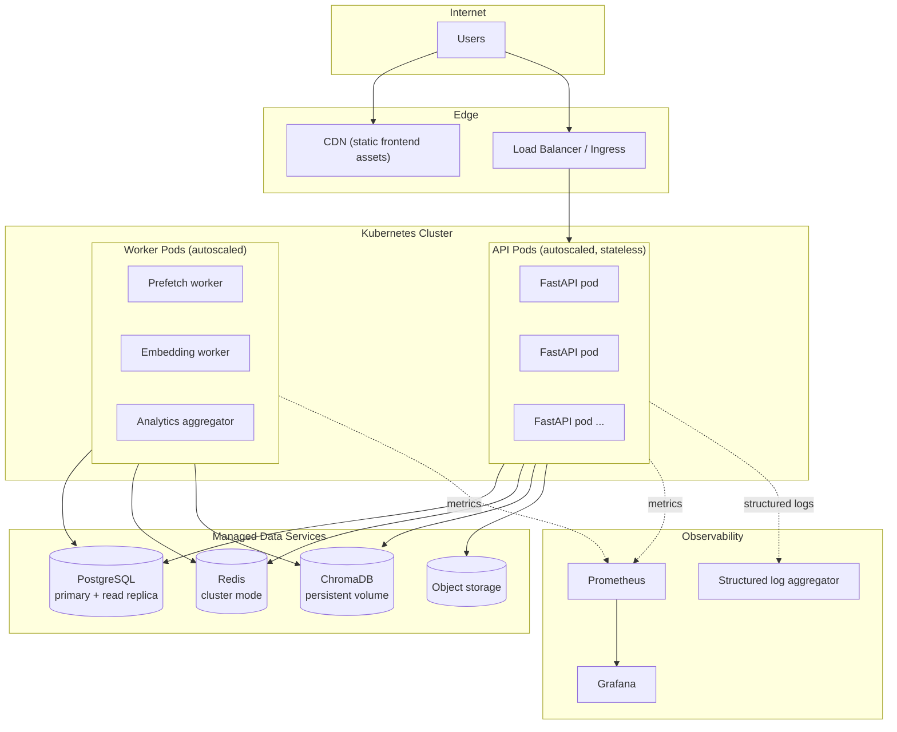

### 22.2 Containerization

Backend, frontend, and each worker type ship as separate Docker images from a shared base (Section 20's `infra/docker-compose.yml` for local dev, Kubernetes manifests under `infra/k8s/` for staging/production). API pods are horizontally autoscaled on CPU + in-flight-request count; worker pods autoscale on their respective Redis queue depth.

### 22.3 CI/CD pipeline

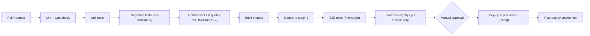

### 22.4 Monitoring, logging, health checks

- **Structured logging** (JSON, request-id + session-id correlated) is carried over and extended from v1's logging work to cover every agent invocation, every cache hit/miss, and every routing decision — this is what makes the Adaptive Router's behavior debuggable in production.
- **Metrics** exported per the performance targets in Section 2.2 directly: histogram of curriculum-generation time, lesson-first-card time, quiz-assembly time, cache hit rate, provider-fallback rate.
- **Health checks:** `/healthz` (liveness — process is up) and `/readyz` (readiness — Postgres/Redis/ChromaDB reachable) on every pod, gating both Kubernetes restarts and load-balancer routing.
- **Rate limiting:** per-user and per-IP token-bucket limits at the API gateway layer, with stricter limits on auth endpoints specifically to blunt credential-stuffing attempts.

### 22.5 Multi-provider LLM layer: fallback, retry, circuit breaker

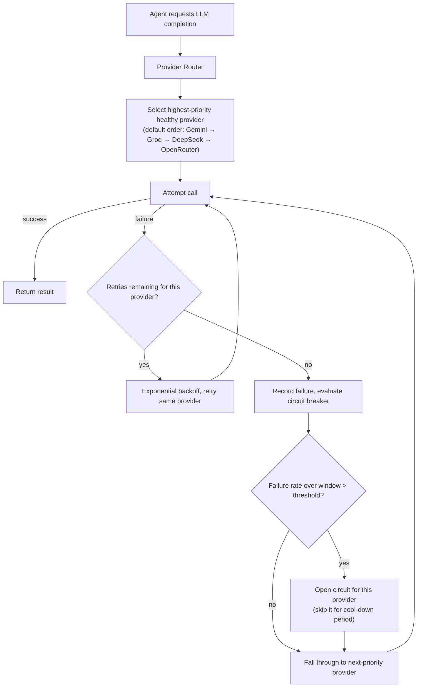

Provider priority is configurable per agent (e.g., Teaching Agent may prefer Gemini for quality; Root Cause narrative may prefer a cheaper/faster provider first) rather than global, since quality/latency/cost tradeoffs differ by call site.

---

## 23. Migration from Current Architecture

### 23.1 Principle: additive first, cutover second

Nothing in v1 is deleted before its v2 replacement is verified in production against real traffic. Migration proceeds in phases, each independently shippable and independently reversible.

| Phase | Action | Reversibility |
|---|---|---|
| **0 — Foundation** | Stand up PostgreSQL, Redis; write dual-write shim so new sessions write to both SQLite (v1) and Postgres (v2) | Fully reversible — v1 keeps running unmodified |
| **1 — Knowledge Graph backfill** | Run existing v1 topic lists through the Knowledge Graph Agent (Section 7.6) to generate the initial graph; human-review low-confidence edges | No user-facing change yet |
| **2 — Agent-by-agent cutover behind a feature flag** | Route Search Agent traffic to the new implementation first (lowest risk — it's an extension, not a rewrite), then Teaching, then Quiz, then Adaptive Routing last (highest behavioral change) | Flag flips back per-agent instantly on regression |
| **3 — Embedding compatibility** | No re-embedding needed — v1 already uses `gemini-embedding-001` at 768 dims (Section 10.1); existing ChromaDB collections are read directly by v2 agents | N/A, this is a compatibility win, not a migration step |
| **4 — Auth + Session introduction** | New capability, not a migration — existing single-user/local mode continues to function until users opt into accounts | Additive |
| **5 — SQLite → Postgres data migration** | One-time ETL of historical lesson/quiz history into the new schema (Section 15), run against a read-only snapshot, verified via row-count and spot-check reconciliation before SQLite is decommissioned | Snapshot retained for N days post-cutover |
| **6 — Decommission v1 code paths** | Remove dual-write shim and legacy single-agent Tutor+Quiz code | Final step, only after Phase 2's flags have been at 100% for a full monitoring cycle |

### 23.2 API versioning

v1's existing endpoints remain live and unmodified at their current paths through Phases 0–5; v2 endpoints are introduced under `/api/v2/` in parallel (Section 16). The frontend is migrated screen-by-screen to call v2 endpoints, rather than a single big-bang frontend swap, which lets Phase 2's per-agent flags actually be validated against real user behavior before the next agent cuts over.

### 23.3 Zero-downtime cutover checklist

- Dual-write verified consistent for 7 days before any read traffic shifts to Postgres.
- Each Phase-2 flag flip monitored against the Section 2.2 latency targets and the golden-set quality eval (Section 21.2) before advancing to the next agent.
- Rollback runbook per phase, tested in staging via deliberate fault injection before the corresponding production flip.

---

## 24. Future Scope

Explicitly out of scope for this document but designed for compatibility with what's specified here:

- **Instructor role** — the `role` enum on `Users` (Section 17.2) already reserves `instructor`; a future instructor dashboard would consume the same Analytics/Dashboard APIs (Section 19) scoped across a cohort rather than a single user.
- **Spaced repetition system** — `ConceptMastery.last_practiced_at` and the decay model referenced in Section 15.3 are the substrate a full spaced-repetition scheduler (e.g., SM-2-style intervals) would build on without a schema change.
- **Voice tutor** — the Teaching Agent's card-based output (Section 12) is structured enough to be read aloud directly; a voice interface would be a new frontend surface over the existing `/lessons/*` API, not a backend redesign.
- **Collaborative / multiplayer learning** — shared quiz sessions, peer comparison on the dashboard; would extend `Sessions` to support multi-user session groups.
- **Mobile app** — the stateless API layer and SSE-based lesson streaming (Section 3) are transport-agnostic; a native client is an additional frontend, not a backend change.
- **LMS integrations** (Canvas, Moodle) — syllabus ingestion (Section 7.6) already accepts arbitrary PDF/text input; an LMS connector would be an additional ingestion source feeding the same Knowledge Graph Agent pipeline.
- **Marketplace of curated knowledge graphs** — instructor- or community-curated `Topics`/`TopicEdge` sets (Section 7) that a student can import instead of generating one from a syllabus.
